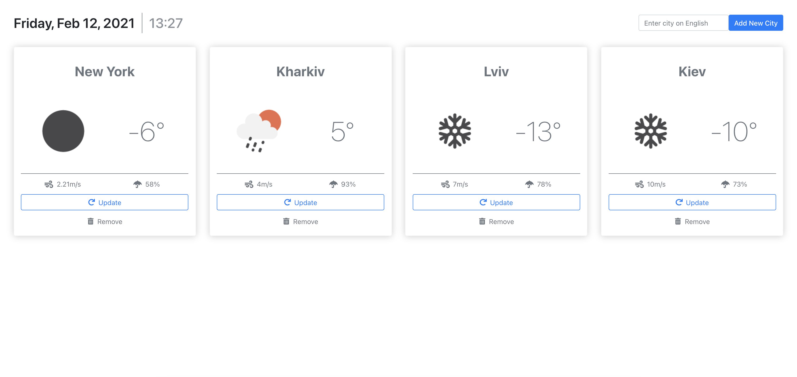

# Weather App

## Description

This is a simple app that shows current weather for different cities.
You can add a new city card by submitting city name in search bar.
Cards are clickable. By clicking on the card you get 24-hours forecast.
Also you may remove cards or update them.

API data comes from http://openweathermap.org/

## Preview

[](https://zzzhyrov.github.io/weather-app/)

> ## Tech stack

- React / React-Router / React Hooks / Redux / Redux Middleware;
- SCSS;
- Bootstrap;
- ESLint / Prettier;
- PropTypes, Reselect, React Transition Group;

## Completed by

> **Yevhenii Zhyrov**

- [ GitHub](https://github.com/zzzhyrov)
- [ Linkedin](https://www.linkedin.com/in/zhyrov/)

## To start project in development mode:

```sh
$ yarn install    // install the dependencies
$ yarn start      // launch 'DevServer'
```

## To build project:

```sh
$ yarn build     // generate a 'production' build
```

## To deploy project to GitHub Pages

```sh
$ yarn build     // generate a 'production' build
$ yarn deploy    // deploy it to 'GitHub Pages'
```
